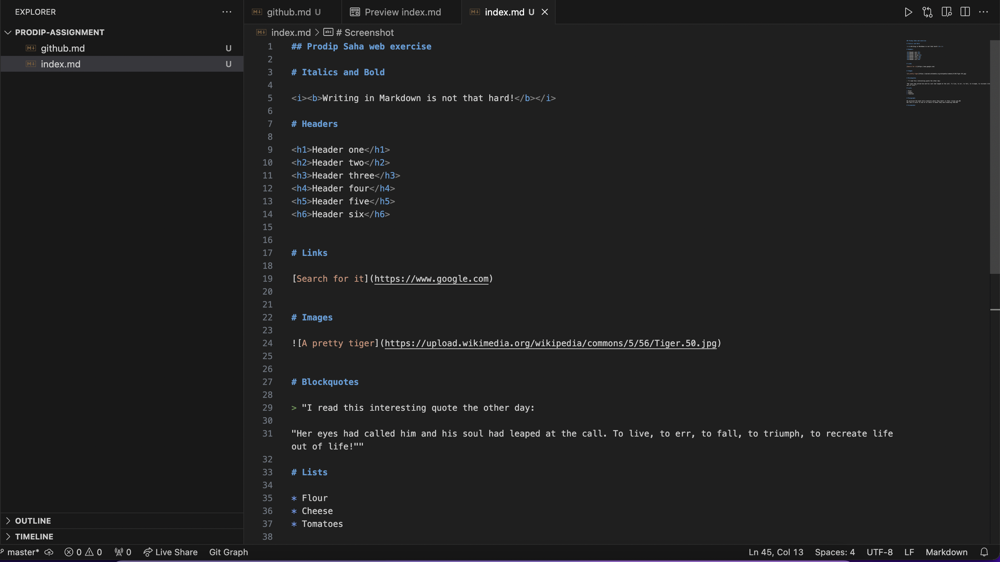

## Prodip Saha web exercise

# Italics and Bold

<i><b>Writing in Markdown is not that hard!</b></i>

# Headers

<h1>Header one</h1>
<h2>Header two</h2>
<h3>Header three</h3>
<h4>Header four</h4>
<h5>Header five</h5>
<h6>Header six</h6>

# Links

[Search for it](https://www.google.com)

# Images

# Blockquotes

> "I read this interesting quote the other day:

"Her eyes had called him and his soul had leaped at the call. To live, to err, to fall, to triumph, to recreate life out of life!""

# Lists

* Flour
* Cheese
* Tomatoes

# Paragraphs

We pictured the meek mild creatures where They dwelt in their strawy pen,··
Nor did it occur to one of us there To doubt they were kneeling then.··

# Screenshot
